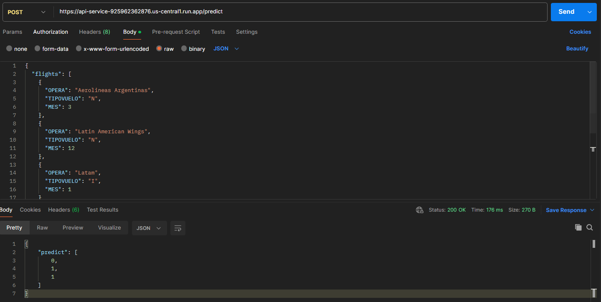
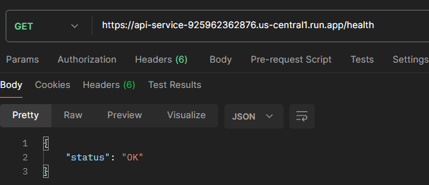
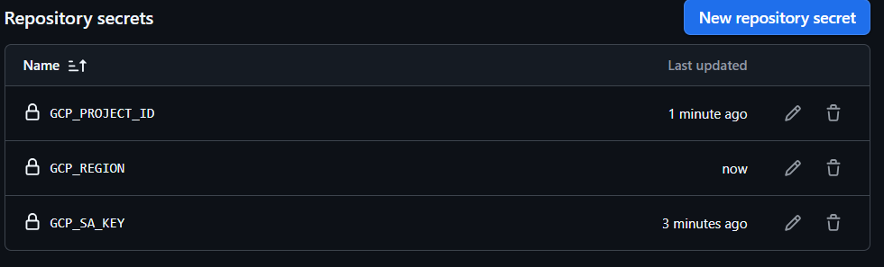

# Software Engineer (ML & LLMs) Challenge - Solución

## Resumen Ejecutivo

Este documento detalla la solución completa del desafío de operacionalización de un modelo de predicción de retrasos de vuelos en el aeropuerto SCL. Se implementó un pipeline completo que incluye:

- **Modelo ML**: XGBoost con top 10 features y balanceo de clases
- **API REST**: FastAPI con validaciones de entrada y endpoint de health check
- **Cloud Deployment**: Google Cloud Run
- **CI/CD**: GitHub Actions con workflows automatizados

---

## Part I: Transcripción y Mejora del Modelo

### Análisis de Bugs Identificados

Antes de implementar `model.py`, se analizó detalladamente el notebook `exploration.ipynb` y se identificaron los siguientes errores:

#### 1. **Error en la función `get_period_day()`**

**Problema**: Las condiciones de comparación no incluían los bordes temporales, dejando 1,230 registros con valor `None`.

**Datos afectados**:
```
05:00:00    469 valores
12:00:00    445 valores
19:00:00    286 valores
11:59:00    16  valores
18:59:00    11  valores
11:00:00     2  valores
23:59:00     1  valores
```

**Código original (incorrecto)**:
```python
if(date_time > morning_min and date_time < morning_max):
    return 'mañana'
elif(date_time > afternoon_min and date_time < afternoon_max):
    return 'tarde'
elif(
    (date_time > evening_min and date_time < evening_max) or
    (date_time > night_min and date_time < night_max)
):
    return 'noche'
```

**Código corregido**:
```python
if morning_min <= date_time <= morning_max:
    return 'mañana'
elif afternoon_min <= date_time <= afternoon_max:
    return 'tarde'
else:
    return 'noche'
```

#### 2. **Errores en sintaxis de visualizaciones**

Se corrigieron argumentos faltantes en `sns.barplot()` especificando explícitamente `x=` e `y=` según versión de seaborn en `requirements-dev.txt`.

#### 3. **Función `get_rate_from_column()` - Cálculo inverso**

La función calculaba el inverso del porcentaje esperado (ej: Houston mostraba 19% en lugar de 5%). Se documentó como observación sin cambiar ya que su impacto era solo visual.

#### 4. **Selección de top 10 features**

La selección de los 10 features más importantes no coincide exactamente con los primeros 10 según la métrica de importancia. En particular, la variable esperada dentro del ranking 'MES_6', no fue incluida, mientras que 'OPERA_Copa Air' si lo fue. Se asume que esta decisión responde a un criterio de diseño o limpieza del modelo, posiblemente con el objetivo de evitar una sobre-representación de variables relacionadas con el mes (MES_*) o reducir redundancia en el set de features. Dado que se trata de un challenge, se considera razonable asumir esta decisión sin requerir validación adicional, aunque en un entorno productivo sería necesario consultar la justificación detrás de esta selección. 


### Modelo Seleccionado: XGBoost

**Decisión**: XGBoost con top 10 features + class balancing

**Justificación**:
- Ambos modelos (XGBoost y LogisticRegression) presentan performance equivalente
- **Accuracy**: 55%
- **Precision (clase 1)**: 25% | **Recall (clase 1)**: 69%
- **Ventajas de XGBoost**:
  - Mayor capacidad para capturar no-linealidades en patrones de delays
  - Escalable a mejoras futuras (feature engineering, hyperparameter tuning)
  - Estándar industrial para predicción de delays
  - Mejor posicionamiento para producción

**Métricas XGBoost**:
```
Confusion Matrix:
[[9556, 8738],
 [1313, 2901]]

              precision  recall  f1-score  support
        0       0.88      0.52      0.66    18294
        1       0.25      0.69      0.37     4214

accuracy                           0.55    22508
```

### Implementación en `model.py`

**Cambios principales**:
1. Separación clara entre flujo de **training** y **predicción**
2. En predicción, rellenar con 0 los features faltantes del top 10 (indica ausencia de patrón)
3. Aplicación de buenas prácticas.
4. Corrección en ruta de datos en tests (cambio de `../data/data.csv` a `data/data.csv`).

**Tests**: `make model-test` ✅ Todos pasan


---

## Part II: API REST con FastAPI

### Arquitectura

**Archivo**: `api.py`

**Componentes principales**:

1. **Inicialización del modelo**:
   ```python
   model = DelayModel()
   data = pd.read_csv("data/data.csv")
   features, target = model.preprocess(data, target_column="delay")
   model.fit(features, target)
   ```

2. **Validaciones de entrada**:
   - `MES`: 1-12
   - `TIPOVUELO`: "N" (Nacional) o "I" (Internacional)
   - En un futuro tambien se podria validar si viene de un aerolinea existente.

3. **Endpoints**:
   - `GET /health`: Verificación de disponibilidad
   - `POST /predict`: Predicción de delays para uno o múltiples vuelos

### Respuesta API

**Request**:
```json
{
  "flights": [
    {
      "OPERA": "Aerolineas Argentinas",
      "TIPOVUELO": "N",
      "MES": 3
    },
    {
      "OPERA": "Latin American Wings",
      "TIPOVUELO": "N",
      "MES": 12
    },
    {
      "OPERA": "Latam",
      "TIPOVUELO": "I",
      "MES": 1
    }
  ]
}
```

**Response**:
```json
{
    "predict": [
        0,
        1,
        1
    ]
}
```

**Tests**: `make api-test` ✅ Todos pasan


---

## Part III: Cloud Deployment en GCP

### Configuración

- **Servicio**: Google Cloud Run
- **Región**: `us-central1`
- **Autenticación**: `--allow-unauthenticated`

### Deployment

**Comando ejecutado**:
```bash
gcloud run deploy api-service \
  --source . \
  --region us-central1 \
  --allow-unauthenticated
```

**URL de producción**:
```
https://api-service-925962362876.us-central1.run.app
```

### Validación y Stress Testing

**Get y Post por Postman**:





**Stress Test Results**:
- **Total requests**: 4,256
- **Fallas**: 0 (0.00%)
- **Throughput**: ~71 requests/segundo
- **Latencia promedio**: 418 ms
- **Percentiles**:
  - P50: 380 ms
  - P90: 780 ms
  - P99: 1,000 ms
  - P100: 1,400 ms

**Interpretación**: La API maneja la carga esperada con excelente confiabilidad. El 99% de requests se completa en menos de 1 segundo, adecuado para operaciones de predicción de delays.

**Tests**: `make stress-test` ✅ Pasa con 0 errores


---

## Part IV: CI/CD Pipeline

### Estructura

```
.github/
└── workflows/
    ├── ci.yml
    └── cd.yml
```

### CI Pipeline (`ci.yml`)

**Triggers**: Push en cualquier rama + Pull Requests

**Checks ejecutados**:
```yaml
- make model-test
- make api-test
```

**Características**:
- Se ejecuta en todas las ramas para asegurar calidad
- Detección temprana de errores
- Tiempo de ejecución: ~1-3 minutos

### CD Pipeline (`cd.yml`)

**Trigger**: Push a rama `main` únicamente

**Pasos**:
1. Checkout del código
2. Autenticación en GCP (via secrets)
3. Deployment a Cloud Run
4. Verificación de health endpoint

**Secrets configurados**:
- `GCP_PROJECT_ID`
- `GCP_SA_KEY` (Service Account JSON)



### Estrategia GitFlow

```
main          → Versión en producción (100% estable)
    ↑
develop       → Rama de integración
    ↑
feature/*     → Ramas de features individuales
```

**Flujo**:
1. Feature se crea desde `develop`
2. Pull Request a `develop` con CI checks
3. Merge a `develop` tras aprobación
4. Release PR de `develop` → `main`
5. CD deployment automático en `main`

### .gitignore

Se excluyen:
- `__pycache__/`, `.pytest_cache/`
- Archivos de sistema (`.DS_Store`)
- Archivos temporales

---

## Resumen de Resultados

| Componente | Estado | Observaciones |
|-----------|--------|---------------|
| **Model Tests** | ✅ Passing | XGBoost con balanceo de clases |
| **API Tests** | ✅ Passing | Validaciones de entrada implementadas |
| **Stress Tests** | ✅ Passing | 0% error rate, P99 < 1s |
| **Cloud Deployment** | ✅ Cloud Run operativo |
| **CI/CD** | ✅ Configured | Workflows automáticos en GitHub Actions |

---

## Tecnologías Utilizadas

- **ML Framework**: XGBoost, scikit-learn
- **API Framework**: FastAPI
- **Cloud**: Google Cloud Run
- **CI/CD**: GitHub Actions
- **Language**: Python 3.8+
- **Data Processing**: pandas, numpy

---

## Notas de Implementación

1. **Reproducibilidad**: El modelo se entrena automáticamente al iniciar la API con `data/data.csv` que puede ser actualiza por otro dato.
2. **Validaciones**: Se implementaron validaciones de entrada para evitar predicciones inválidas
3. **Performance**: La API está optimizada para manejar múltiples predicciones por request
4. **Escalabilidad**: Cloud Run escala automáticamente según carga; no requiere gestión manual de infraestructura

---

## Conclusión

La solución completa operacionaliza el modelo de predicción de delays de forma robusta, implementando un pipeline CI/CD automático y deployment en cloud production-ready. El sistema está operativo y listo para ser consumido por el equipo del aeropuerto SCL.

### Mejoras Futuras:

Para un ambiente de producción real se podrían considerar:

- **Monitoreo**: Implementar alertas en Cloud Monitoring para latencia, error rate y degradación de modelo
- **Reentrenamiento**: Pipeline de reentrenamiento automático con datos nuevos (drift detection)
- **Versioning**: Model registry (MLflow) para control de versiones de modelos
- **Load Balancing**: Multi-región deployment para alta disponibilidad
- **Caché**: Redis para predicciones frecuentes (mismo vuelo)
- **Logging**: Structured logging en Cloud Logging para auditoría y debugging
- **A/B Testing**: Framework para validar mejoras de modelo en producción
- **Seguridad en api**: Agregar seguridad en la API con autenticación