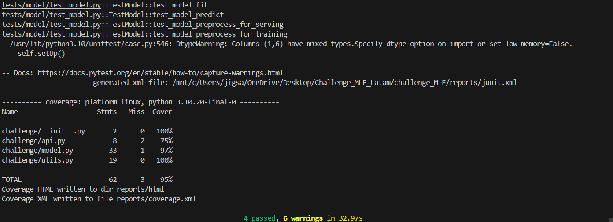
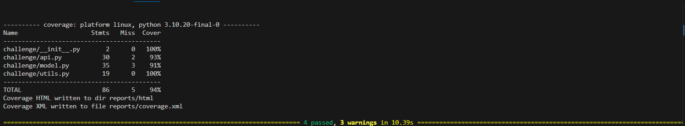
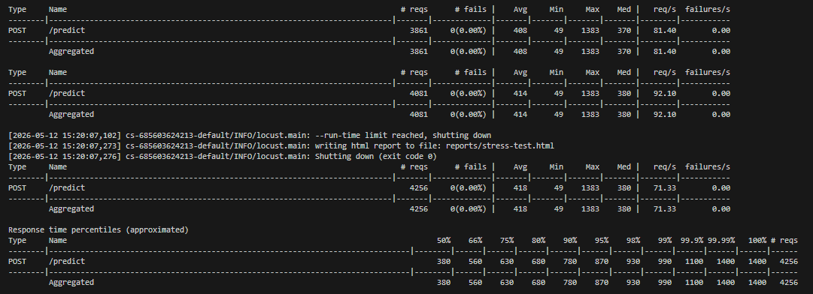

Part I: 

Primero revise el 'exploration.ipyn' para observar bugs y se observaron algunas incoherencias que fueron arregladas en 'exploration_mod.ipynb'. (Primero me gusta dejarlo todo correcto en un ipynb y entenderlo y luego pasar a codear la solución en el 'model.py'). En el exploration.ipynb no se modificaron funciones pero si se crearon bloques de codigo para analizar datos (value_counts, filtros, etc...).

A continuacion se detallan los 'errores' encontrados:

1- En la creación de la variable 'Period_day' quedaban muchos valores con 'None' y es porque estaban mal las reglas, dejando sin considerar cuando la variable 'Date-I' era 05:00:00, 19:00:00 y 12:00:00. (1230 datos quedaban con None). 

Esto era por las reglas del if elif 

original:

    if(date_time > morning_min and date_time < morning_max):
        return 'mañana'
    elif(date_time > afternoon_min and date_time < afternoon_max):
        return 'tarde'
    elif(
        (date_time > evening_min and date_time < evening_max) or
        (date_time > night_min and date_time < night_max)
    ):
        return 'noche'

    
estan dejando afuera los bordes por las condiciones < , > sin incluirlos: 
Fecha-I
05:00:00    469
12:00:00    445
19:00:00    286
11:59:00     16
18:59:00     11
00:00:00      2
23:59:00      1
Name: count, dtype: int64

modificado: 
        if morning_min <= date_time <= morning_max:
        return 'mañana'
    elif afternoon_min <= date_time <= afternoon_max:
        return 'tarde'
    else:
        return 'noche'

2- Se arreglaron syntaxis en los graficos sns.barplot() donde habia que decir que variable era x = y cual era y = (si no fallaba incluso con la versión que indicaban en requirements-dev.txt)

3- me di cuentas que la función get_rate_from_column() esta "mala" si lo que se busca es sacar el % de x / total ya que realmente lo hace al revez. Por ejemplo si queremos ver el % de delay dependiendo de que ciudad va, en Houston nos da un % alto 19% cuando realmente seria el 5%. Al ser solo visual no se modifico la función (no se creo variable con eso ni influye en el modelo).

4- El top 10 features no se tomaron los 10 primeros. Asumire que fue por alguna decisión como no dejar tantos atributos como 'MES' ('MES_6' no entra y entra el 11 que era 'OPERA_Copa Air'). En otro contexto podria preguntar el porque pero al ser un challenger puedo asumir supuestos.

Observadno los datos de LR y XGboost con los 10 features mas importantes y con balance:

XGBoost: 
confusion matriz 
array([[9556, 8738],
       [1313, 2901]])

                   precision    recall  f1-score   support

           0       0.88      0.52      0.66     18294
           1       0.25      0.69      0.37      4214

    accuracy                           0.55     22508
   macro avg       0.56      0.61      0.51     22508
weighted avg       0.76      0.55      0.60     22508

LR: 
confusion matriz 

array([[9487, 8807],
       [1314, 2900]])

                     precision    recall  f1-score   support

           0       0.88      0.52      0.65     18294
           1       0.25      0.69      0.36      4214

    accuracy                           0.55     22508
   macro avg       0.56      0.60      0.51     22508
weighted avg       0.76      0.55      0.60     22508

**Modelo seleccionado: XGBoost con top 10 features + class balancing**

Razón: Aunque LogisticRegression y XGBoost tienen performance equivalente (muy parecida),
XGBoost tiene mayor capacidad de aprendizaje para capturar no-linealidades en delays.
Es más escalable a mejoras futuras (feature engineering, tuning) y es el estándar 
industrial para problemas de predicción de delays. Aunque esta decision depende mucho del contexto y que es lo que se quiere,
tambien se podria decir que logisticregression pide menos recursos que XGBoost pero asumimos que no es un problema los recursos.

Empezamos con la creacion en model.py de Part I: 

Se modifico en test_model.py self.data = pd.read_csv(filepath_or_buffer="data/data.csv") en vez de self.data = pd.read_csv(filepath_or_buffer="../data/data.csv") al correr make model-test. (fallaba)

En test_model cuando se llamaba a la funcion test_model_predict se hacia el preprocess y el predict, saltandoce el fit. Si no se hacia el fit antes no habia nada que rpedecir y fallaba. Se agrego al linea dodne se hace el fit antes de predecir esto ocurre pq los test son independientes.

Se separa si el preprocess viene para training o para predecir, si viene para predecir se rellena con 0 los datos faltantes del top 10 feature . (si no no se podria evaluar y tiene sentido pq significa que no son )
al ejecutar make model-test

Part II:

model = DelayModel()

# Valores válidos
VALID_MES = set(range(1, 13))
VALID_TIPOVUELO = {"N", "I"}

#Train the model when the API starts

data = pd.read_csv("data/data.csv")
features, target = model.preprocess(data, target_column="delay")
model.fit(features, target)

Se crean validaciones para que no entren datos a predecir que no tengan sentido (mes distino a 1 - 12 o algun tipo de vuelo distinto a n o I ).
Al iniciar la api se entrena el modelo automaticamente con el data.csv que se tenia con los mismos pasos de la Part I. se inicia con DelayModel(). Se trata de utilizar las misma clase creada en Part I. 

Al ejecutar make api-test:

Part III:

Se seleciono GCP para desplegarsela API, se utilizo CloudRun por sencilles para el proyecto, tambien podria haberse hecho en una VM directamente. Para este caso challenger el modelo es sencillo y la api tambien se hara con cloudrun por sencilles.

Se ejecuta el comando 

gcloud run deploy api-service \
  --source . \
  --region us-central1 \
  --allow-unauthenticated

Service URL: https://api-service-925962362876.us-central1.run.app

Se hacen peticiones con Postman para ver su funcionamiento antes de hacer el make stress-test
/health :

/predict: Se usaron 3 flights distintos (la api puede manejar mas de una solicitud de vuelo ya que se asume que no van a llegar de 1 en 1 si no una lista).

make stress-test:

4256 requests
0 fallas (0.00%)
~71 requests/second
Avg: 418 ms

PercentilSignificado
50%La mitad de las requests tarda < 380 ms
90% 9 de cada 10 requests tarda < 780 ms
99%Casi todas < 1 segundo
100% Peor caso = 1.4 s
Se podia intentar mejorar dependiendo del contexto del negocio y cuantas solicitudes se recibiran. Todo depende del negocio y las necesidades, al ser un challegnger asumimos uqe los rsulados son buenos (casi todo se demora menos de un segundo.)

Part IV:

Se crea el .github y se empeiza a trabajar en workflows ci-cd:

ci:

Verificara que todo este correcto, se correran los make api-test y model-test. No es necesario el make stress-test. Se correra en todas las ramas cuando se haga un push o PR. Se hace simple el el ci, se podria separar en job para mejor legibilidad de donde ocurre el error si es que ocurre pero al ser un proyecto pequeño no es necesario ya que de todas formas si uuno se mete al github action se ve claramente que paso esta ocurriendo.

cd:

Se correra solo en la rama main (se podria hacer que se corra en develop y main y que se suba a distintos lados pero por simplicidad solo sera en la rama main.)

Variables secretas: 

Extras:

Como se indico en el challenger se esta trabajando con GitFlow, creando la rama principal main que es la que esta funcional 100%, esta la development que es donde se juntaran todas las feature/*. Cada nueva feature independiente esta en una branch especifica. 
Se creo un gitignore que elimina archivos y carpetas que no son necesarias que se suban (carpetas temporales o basuras.)